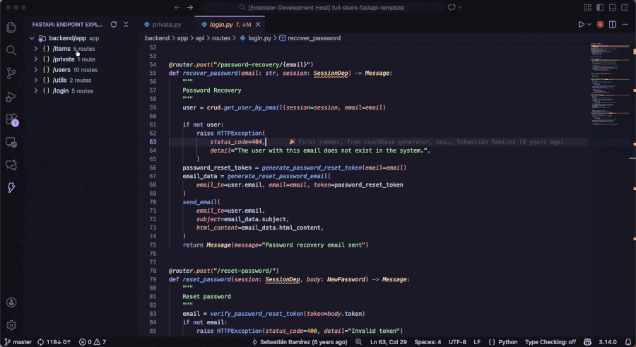
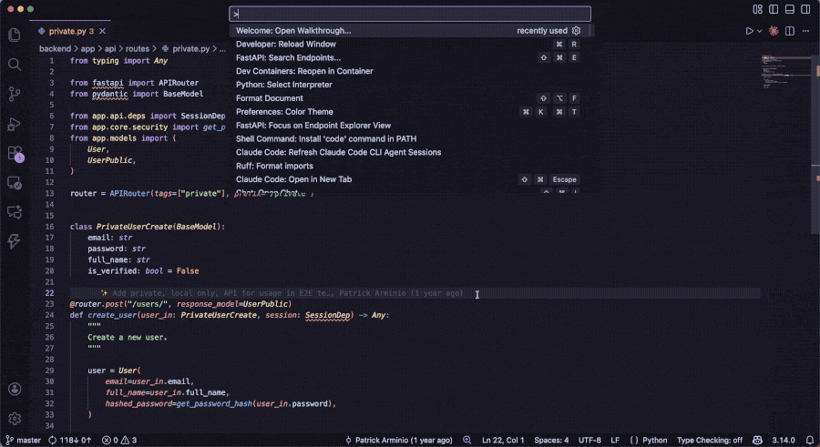
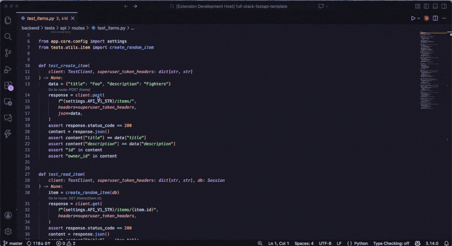

# FastAPI extension for Visual Studio Code

A Visual Studio Code extension for FastAPI application development. Available on the [Visual Studio Marketplace](https://marketplace.visualstudio.com/items?itemName=FastAPILabs.fastapi).

## Overview

This extension enhances the FastAPI development experience in Visual Studio Code by providing:

### Endpoint Explorer

The Endpoint Explorer provides a hierarchical tree view of all FastAPI routes in your application. You can expand routers to see their associated endpoints, and click on any route to jump directly to its definition in the code. You can also jump to router definitions by right-clicking on a router node.

### Search for routes

Using ctrl+shift+E (cmd+shift+E on Mac), you can open the Command Palette and quickly search for routes by path, method, or name.

### CodeLens for test client calls

CodeLens links appear above HTTP client calls like `client.get('/items')`, letting you jump directly to the matching route definition.

## Settings and customization

| Setting | Description | Default |
|---------|-------------|---------|
| `fastapi.entryPoint` | Path to the main FastAPI application file (e.g., `src/main.py`). If not set, the extension searches common locations: `main.py`, `app/main.py`, `api/main.py`, `src/main.py`, `backend/app/main.py`. | `""` (auto-detect) |
| `fastapi.showTestCodeLenses` | Show CodeLens links above test client calls (e.g., `client.get('/items')`) to navigate to the corresponding route definition. | `true` |

**Note:** Currently the extension discovers one FastAPI app per workspace folder. If you have multiple apps, use separate workspace folders or configure `fastapi.entryPoint` to point to your primary app.

## License 

MIT